# GlDrive

**Mount glftpd FTPS servers as native Windows drive letters.** A single tray app for the full site-user workflow — browse in Explorer, auto-download from a wishlist, race releases between sites via FXP, chat on FiSH-encrypted IRC, stream media, watch the PreDB.

Built on .NET 10, WPF, WinFsp, FluentFTP, and GnuTLS. Windows 11, x64. Current version: **1.44.55**.

> **For contributors:** the full architecture reference lives in [docs/](docs/). See [docs/project-overview-pdr.md](docs/project-overview-pdr.md) for the design rationale and [docs/system-architecture.md](docs/system-architecture.md) for Mermaid diagrams and protocol walkthroughs.

## Why this exists

glftpd sites have several quirks that off-the-shelf FTP clients handle badly. Each of these had to be solved for a reliable Windows 11 client:

- **Behind a BNC**, `PASV` returns backend addresses the client can't route to — `CpsvDataHelper` implements CPSV with reverse-TLS data channels by hand
- **TLS 1.3 session tickets** crash glftpd — forced TLS 1.2 + `GnuAdvanced.NoTickets`
- **GnuTLS native disposal** segfaults on corrupted sessions — session neutralized before disposal, `DisconnectWithQuit = false`, `StaleDataCheck = false`
- **Stale BNC sessions** eat slot counts — throttled `!username` ghost-kill automatic on pool failure
- **FXP racing** needs SSCN, SFV-first priority, slot tracking, nuke detection, skiplist cascades, and four different CPSV/PASV modes — cbftp-style engine ships all of it
- **IRC announce channels** are FiSH-encrypted behind `SITE INVITE` — Blowfish (ECB + CBC) + DH1080 + FTP-pool-borrowed `SITE INVITE` before auto-join
- **Native crashes** bypass managed exception handlers — watchdog subprocess + Windows Restart Manager + `.running`/`.updating` markers recover and log the reason from the Event Log

## Features

### Drive mounting
- **Multi-server** — several glftpd sites mounted simultaneously, each on its own drive letter and WinFsp prefix (`\GlDrive\{serverId}`)
- **Optional drive** — connect a server without a drive letter and still get search, downloads, notifications, and IRC
- **Bounded FTPS pool** per server with ghost-kill (`!username`), poisoned-connection tracking, and auto-reinitialize on exhaustion
- **TTL + LRU directory cache** with stale-while-revalidate
- **Whole-file read/write buffering** with auto-spill to `DeleteOnClose` temp files above 50 MB
- **SOCKS5 proxy** per server, credentials in Credential Manager

### Downloads
- Streaming FTP-to-disk with **resume** (REST for CPSV, positional `OpenRead` for standard)
- **Auto-retry** with exponential backoff, scheduling windows (e.g. 22:00 → 06:00), CRC32 SFV verification before extraction
- **Auto-extraction** for RAR including multi-volume old-style (`.r00/.r01`) and modern (`.part01.rar`) naming
- **Category download paths** — route `TV` to `D:\TV`, `Movies` to `D:\Movies`, etc.
- Duplicate detection, NFO pre-check, disk space validation, drag-drop from Notifications or Search

### Notifications & wishlist
- `/recent` polling with excluded-category filters and debounced toast notifications
- **Wishlist** with TVMaze/TMDB/OMDB metadata and quality profiles (Any/SD/720p/1080p/2160p)
- **Auto-download** of matching releases across *all* connected servers via `SceneNameParser` + `WishlistMatcher`
- Wishlist import/export as JSON; completion toasts with optional sound

### IRC client
- TCP + TLS via `SslStream`, TOFU cert validation (shared with FTP), keepalive + PING liveness, exponential-backoff reconnect that resets only after 60 s of stability (BNC rate-limit friendly)
- **FiSH** Blowfish encryption in ECB and CBC modes with peer-mode auto-detect; keys DPAPI-encrypted per server
- **DH1080** 1080-bit key exchange with validated public keys; SHA-256 of the shared secret as the Blowfish key
- **SITE INVITE** integration — borrows an FTP pool connection to run `SITE INVITE <nick>`, then auto-joins with retry on `473 ERR_INVITEONLYCHAN`
- **Announce detection** — built-in verbose glftpd pattern + custom regex rules (200 ms timeout, 500-entry LRU dedup), auto-race to `SpreadManager`
- **Pattern learning** — `IrcPatternDetector` identifies bots, infers announce regex, surfaces as clickable suggestions
- Channel sidebar grouped by server, nick list with mode prefixes (`@/+/%/~/&`), Tab completion, clickable release names, slash commands (`/join /part /msg /me /topic /key /keyx …`), raw IRC passthrough

### Spread / FXP (cbftp-style race engine)
- **Four FXP modes** picked automatically by `FxpModeDetector` — PASV-PASV, CPSV-PASV, PASV-CPSV, and **Relay** (CPSV-CPSV piped through local memory with double-buffered 256 KB copy)
- **Per-server FXP connection pool** separate from the main pool, auto-sized to `max(SpreadPoolSize, maxSlots)`, auto-reinitialized before each race
- **Chain mode** — one route per release at a time, holds until all in-flight transfers drain
- **Scoring 0 – 65535** — SFV = 65535, NFO-after-15 s = 65535, then file size + route speed (rolling 10-sample avg) + site priority + ownership delta
- **Skiplist cascade** — per-site then global, glob or non-backtracking 100 ms regex, first match wins
- **Pre-transfer guards** — `TYPE I` canary, `SSCN ON`, deferred `MKD` until just before `STOR`, completion sweep with 3× retry
- Race history persisted (max 500) with full skiplist trace; auto-race on IRC announce or `/recent` detection

### Archive extractor
- Drag-drop RAR/ZIP/7z/TAR/GZ/BZ2/XZ/ISO/CAB with multi-volume RAR detection (old and modern naming, total set size)
- **Watch folders** with debounced `FileSystemWatcher`, auto-extract, optional delete-after
- **Folder cleaner** — scan a media root for leftover archives alongside extracted media, bulk reclaim
- Low-priority extraction thread; persistent settings

### Player
- Embedded VLC (LibVLCSharp) with direct play from mounted drives
- **HTTP media server** — local `HttpListener` streams from FTP with Range/seek, caches extracted video in the library dir
- **RAR-wrapped video** — sequential volume download with 5× retry, on-the-fly extraction, playback as soon as the first `.rar` is ready
- **Chromecast / DLNA** casting via VLC renderer discoverer; **TMDB** trending/upcoming browser
- **Torrent search + streaming** (MonoTorrent) — parallel apibay/SolidTorrents/Torrents-CSV, DHT, HTTP streaming with seek
- Resume tracking per release name

### Search
- **Cross-server** parallel search, results tagged with server name
- **Per-server modes** — Auto, SITE SEARCH (server-side), Cached Index (background crawler), Live Crawl
- Borrows connections with 15 s timeout so search doesn't starve downloads

### UI & system
- **Dark / Light** themes, runtime-swappable via `DynamicResource`, system-theme detection
- System tray with dynamic per-server menu and state-colored glyph
- 5-step first-run wizard, hot-reload on settings save (new servers mount without restart)
- **Auto-update** from GitHub Releases, SHA-256 mandatory, Authenticode issuer check when signed
- **Watchdog subprocess** + Windows Restart Manager for native crash recovery, reason pulled from Event Log
- Embedded WebView2 tabs (World Monitor / Discord / Streems) with serialized init and fallback UI
- Site import from FTPRush (XML/JSON) and FlashFXP (XML/DAT); remote glftpd installer via SSH.NET

See the [Security](#security) table below and [docs/changelog.md](docs/changelog.md) for recent releases.

## Screenshots

### Dashboard
| Notifications | Wishlist | Downloads |
|---|---|---|
| 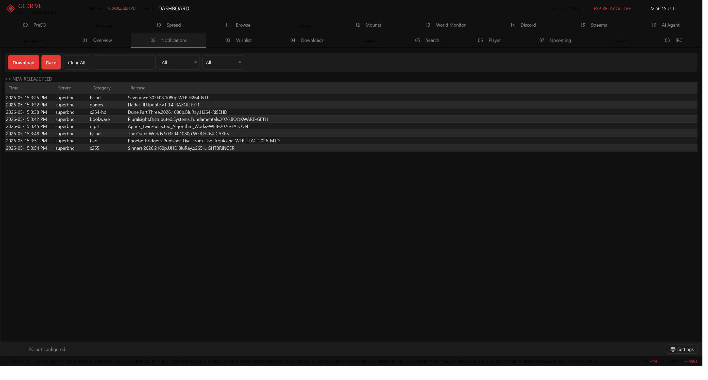 | 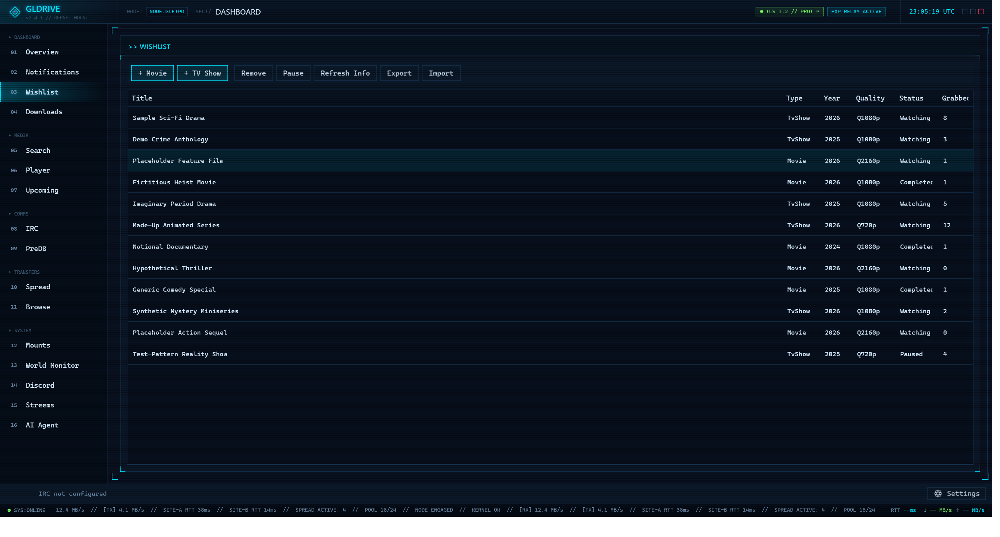 | 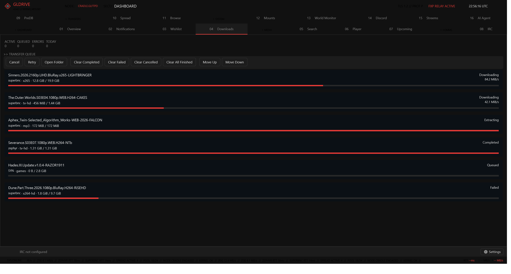 |

| Search | Upcoming |
|---|---|
| 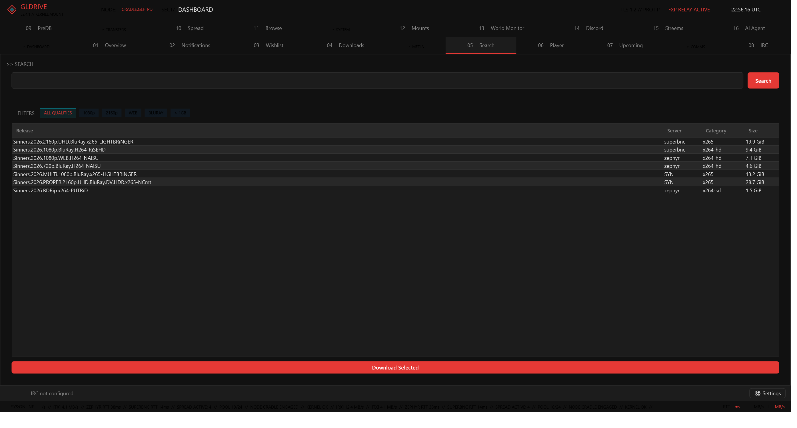 | 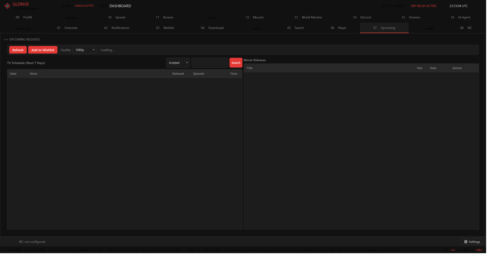 |

### Settings
| Servers | Performance | Downloads | Diagnostics |
|---|---|---|---|
| 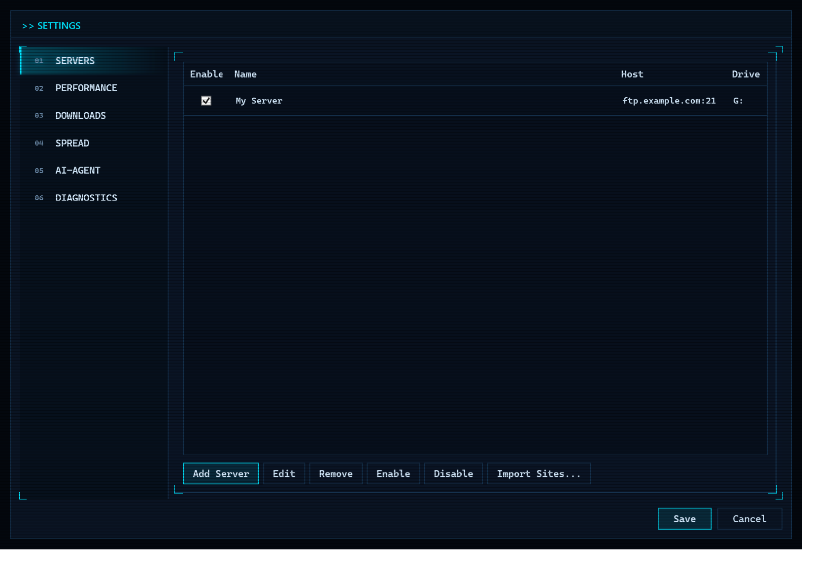 | 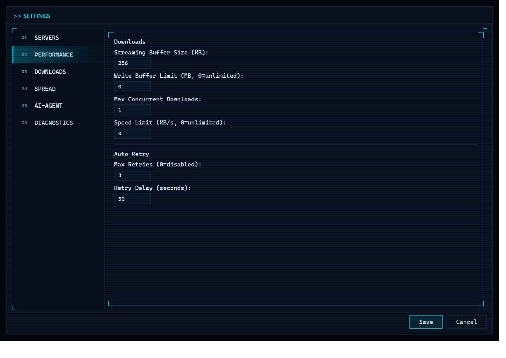 | 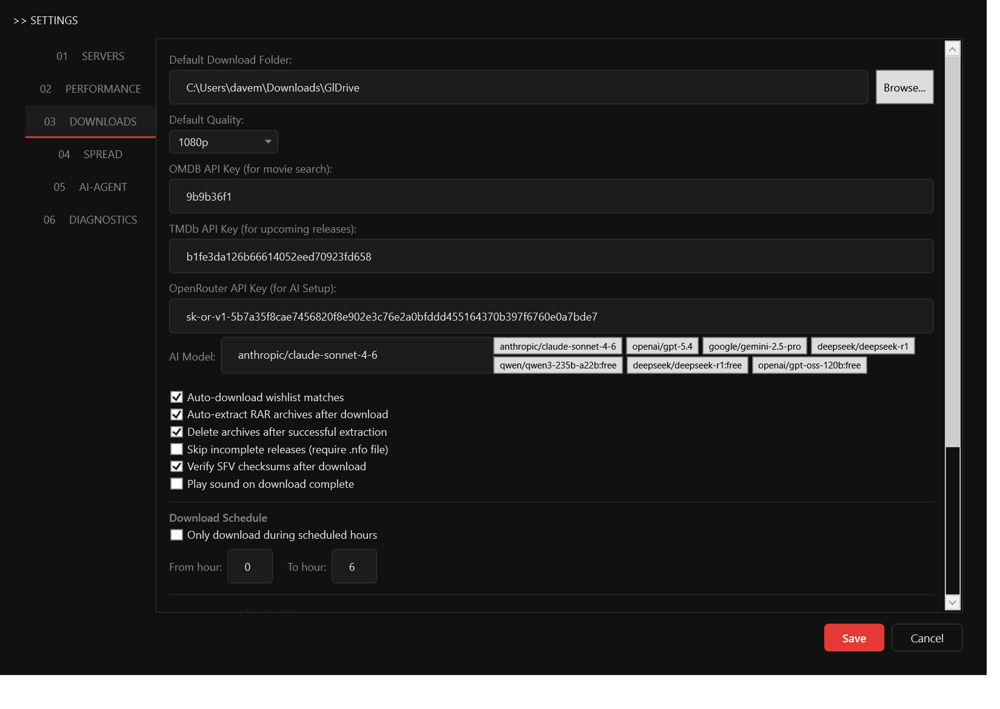 | 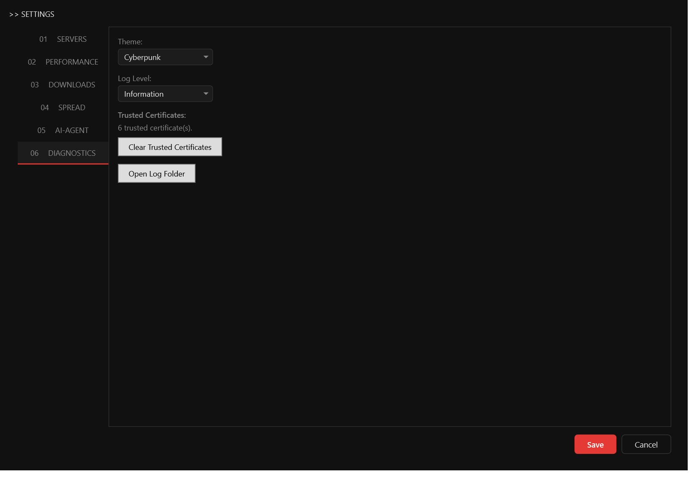 |

### Setup wizard
| Welcome | Connection | TLS |
|---|---|---|
| 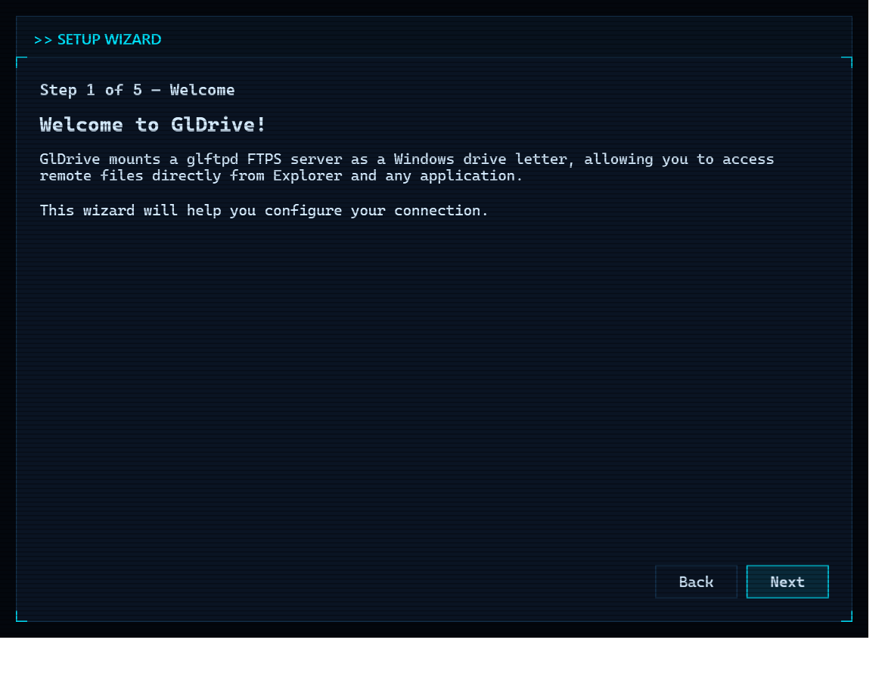 | 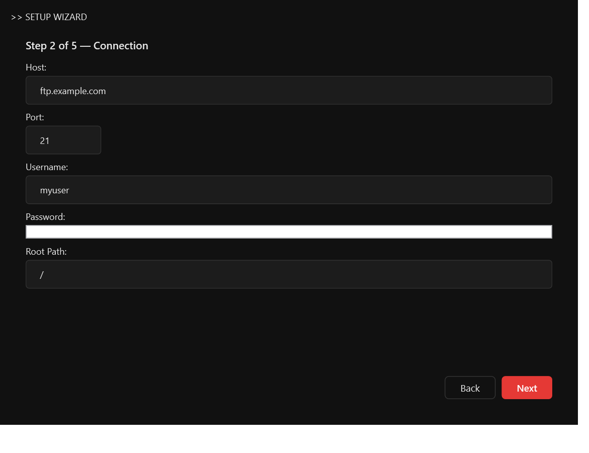 | 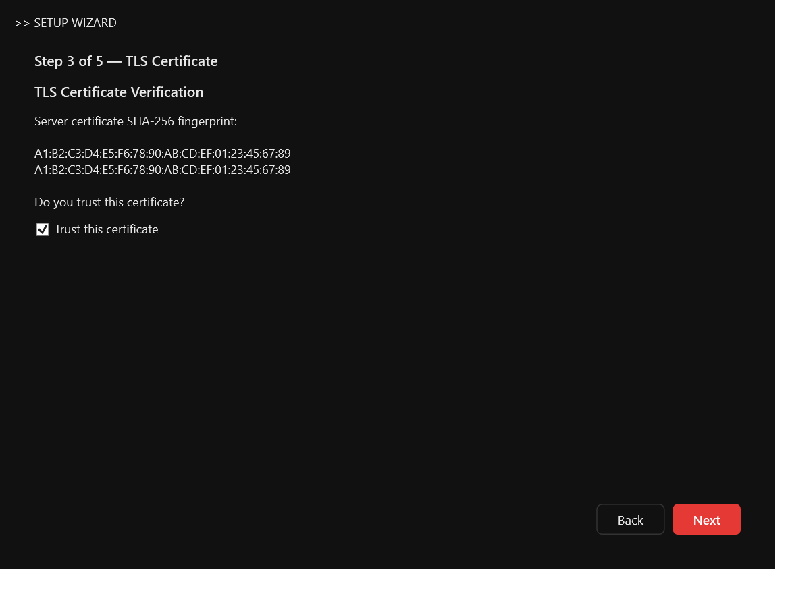 |

| Mount | Confirm |
|---|---|
| 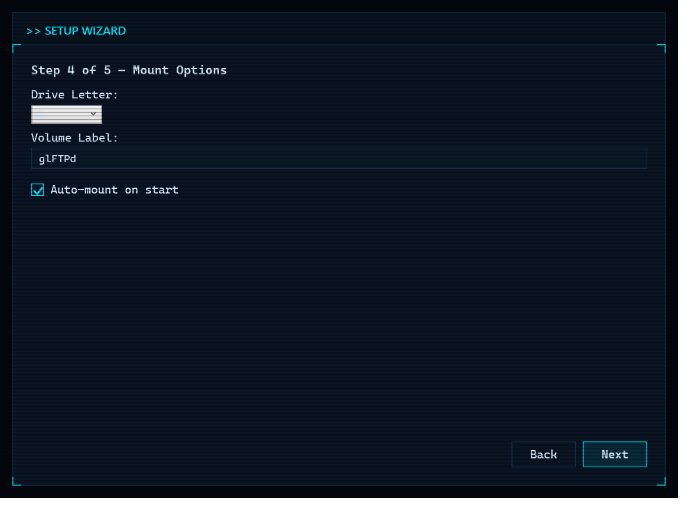 | 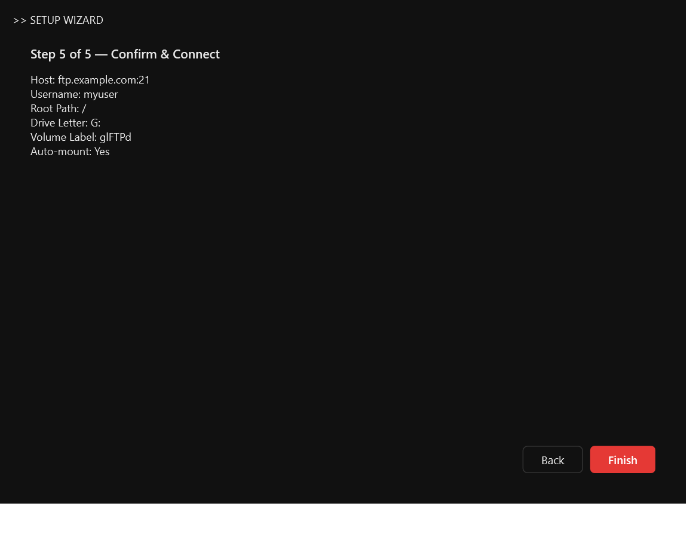 |

## Installation

### Installer (recommended)

Download `GlDriveSetup-v{version}.exe` from the [Releases](../../releases) page and run it. The installer:

1. Installs **WinFsp** silently if not already present (bundled in the installer)
2. Copies GlDrive to `Program Files\GlDrive`
3. Creates Start Menu and optional Desktop shortcuts
4. Optionally registers auto-start via `HKCU\...\Run`

No .NET runtime install needed — the app is self-contained on `net10.0-windows/win-x64`.

**Upgrades preserve data.** The uninstaller deliberately does **not** touch `%AppData%\GlDrive\`, so config, trusted certs, credentials, wishlists, FiSH keys, and race history all survive reinstall cycles.

### Build from source

Prerequisites: [.NET 10 SDK](https://dotnet.microsoft.com/download), [WinFsp](https://winfsp.dev/) pre-installed, Windows 11 x64.

```bash
git clone https://github.com/misterentity/GlDrive.git
cd GlDrive
dotnet build src/GlDrive/GlDrive.csproj
dotnet run   --project src/GlDrive/GlDrive.csproj
```

The `.sln` file has no project references — always target the `.csproj` directly.

### Build the installer yourself

Additional prerequisite: [Inno Setup 6](https://jrsoftware.org/isinfo.php) with `ISCC.exe` discoverable.

```powershell
# Publish + Inno Setup installer + update zip
powershell -File installer/build.ps1

# Full release: build + GitHub release with checksums (requires gh CLI)
powershell -File installer/release.ps1
```

Version is read from `<Version>` in `src/GlDrive/GlDrive.csproj`. Full pipeline docs: [docs/deployment-guide.md](docs/deployment-guide.md).

## Quick start

1. **Launch** → first-run wizard: host, port, username, password, drive letter. Password goes to Credential Manager; config JSON gets non-secrets only
2. **TLS** → auto-trust the first cert (TOFU); changes later pop a confirmation dialog
3. **Explorer** → your drive letter appears as `glFTPd (G:)`
4. **Add more servers** → Settings → Servers → Add. Configure per-server IRC, Spread, Pool, Cache, Notifications, Speed
5. **Wishlist** → Dashboard → Wishlist. OMDB/TMDB/TVMaze search, quality profile, auto-download on match
6. **Spread** → enable on ≥ 2 sites, set sections/priority/slots, then race from Dashboard → Spread (`Ctrl+R`) or right-click Notifications/Search/PreDB
7. **IRC** → configure per server; `/keyx <nick>` for FiSH key exchange

## Dashboard tabs

**Notifications / Wishlist / Downloads / Search / Upcoming / PreDB / Player / Spread / Browse / IRC / World Monitor / Discord / Streems.**

Highlights: Notifications and Search are drag sources for Downloads. PreDB live-feeds predb.net with auto-refresh and section filter. Spread surfaces active jobs, scoreboard, auto-race activity log, and race history with full skiplist evaluation traces. Browse is dual-pane with multi-select FXP. IRC groups channels by server with clickable release names in messages.

## Keyboard shortcuts

| Key | Context | Action |
|---|---|---|
| `Delete` | Downloads | Cancel selected |
| `R` | Downloads | Retry failed |
| `Enter` | Notifications / Search / PreDB | Download selected |
| `Ctrl+R` | Spread | Start new race |
| `Escape` | Spread | Stop selected race |
| `Tab` | IRC input | Cycle nick completion |
| `Space` | Player | Play / pause |
| `F` / `F11` | Player | Fullscreen |
| `Esc` | Player | Exit fullscreen |
| `← / →` | Player | Seek ±10 s |
| `↑ / ↓` | Player | Volume ±5 |

## Configuration data

Everything per-user lives under `%AppData%\GlDrive\`. Full schema with defaults: [docs/configuration-guide.md](docs/configuration-guide.md).

| Data | Location |
|---|---|
| App config | `appsettings.json` (camelCase JSON, non-secrets only) |
| Downloads (per server) | `downloads-{serverId}.json` |
| Race history | `race-history.json` (max 500) |
| Wishlist | `wishlist.json` (global) |
| Notifications | `notifications.json` (max 1000) |
| Trusted certs | `trusted_certs.json` (TOFU, user-only ACL) |
| FiSH keys (per server) | `fish-keys-{serverId}.json` (DPAPI-encrypted) |
| Extractor settings | `extractor-settings.json` |
| Logs | `logs/gldrive-{date}.log` (daily rolling) |
| Passwords / API keys | Windows Credential Manager |

## Architecture

```
Program.cs (watchdog + update applier)
  └─ App.xaml.cs
       ├─ SingleInstanceGuard, ConfigManager, SerilogSetup, CertificateManager (TOFU)
       ├─ WizardWindow (first run)
       ├─ ServerManager
       │    ├─ per server: MountService
       │    │    ├─ FtpClientFactory → FtpConnectionPool → FtpOperations → CpsvDataHelper
       │    │    ├─ DirectoryCache → GlDriveFileSystem (WinFsp, prefix \GlDrive\{id})
       │    │    ├─ ConnectionMonitor, NewReleaseMonitor
       │    │    ├─ DownloadManager + DownloadStore + StreamingDownloader
       │    │    └─ FtpSearchService, WishlistMatcher
       │    ├─ per server: IrcService (IrcClient + FishCipher + Dh1080 + FishKeyStore
       │    │                           + IrcAnnounceListener + IrcPatternDetector)
       │    └─ SpreadManager (per-server FXP pools, SpreadJob, FxpTransfer,
       │                     SpreadScorer, SpeedTracker, SkiplistEvaluator, RaceHistoryStore)
       ├─ WishlistStore, NotificationStore (global), UpdateChecker
       └─ TrayIcon + DashboardWindow + ExtractorWindow + ThemeManager
```

Subsystems are decoupled: each `MountService` builds its own full composition chain; `SpreadManager` keeps a **separate** FTP pool per server so races can't starve the filesystem/downloads pool. Mermaid diagrams and the full startup/FTP/CPSV/FXP/IRC/update flows live in [docs/system-architecture.md](docs/system-architecture.md).

## CPSV (glftpd behind a BNC)

Off-the-shelf FTP clients can't talk to glftpd behind a BNC because `PASV` returns backend addresses the client can't route to. `Ftp/CpsvDataHelper.cs` implements the workaround by hand:

1. Send `CPSV` on the control channel → backend `(a,b,c,d,p1,p2)` returned in PASV format
2. Raw TCP connect to that address (10 s timeout, no TLS yet)
3. Send the data command (`LIST -a`, `RETR`, `STOR`) on the **control** channel; expect `150`/`125`, do **not** wait for `226`
4. **TLS `AuthenticateAsServerAsync`** on the raw socket with a cached self-signed RSA-2048 cert — glftpd calls `SSL_connect` on the data side, so we have to be the TLS **server**
5. Stream the data (LIST → parse Unix `ls -l`; RETR → binary; STOR → binary)
6. Close the data socket, then read `226` on the control channel

Resume for `RETR` sends explicit `REST <offset>` before the retry. Before every FXP transfer, `FxpTransfer.SendTypeI()` acts as a canary for BNC response-queue desync; `EnableSscn()` sends `SSCN ON` for encrypted FXP control data. Full protocol walkthrough: [docs/system-architecture.md#cpsv-data-connections](docs/system-architecture.md#cpsv-data-connections).

## Security

| Concern | Measure |
|---|---|
| Credentials | Windows Credential Manager (DPAPI); never in config files or logs |
| Log redaction | FTP `PASS` command + IRC server password redacted by adapters |
| FiSH keys | Stored DPAPI-encrypted per server in `fish-keys-{serverId}.json` |
| Cert pinning | TOFU SHA-256 in `trusted_certs.json`, user-only ACL, rotation prompt required |
| FTP command injection | `CpsvDataHelper.SanitizeFtpPath` strips CR/LF/NUL before every wire path |
| GnuTLS native crashes | `NeutralizeGnuTls` before disposal, `DisconnectWithQuit = false`, `StaleDataCheck = false` |
| Poisoned connections | `PooledConnection.Poisoned` routes to `Discard` instead of `Return` |
| DH1080 | Peer public-key range check prevents trivial shared-secret recovery |
| Updates | SHA-256 mandatory against `checksums.sha256`; Authenticode issuer match when signed |
| Crash recovery | Watchdog subprocess + Windows Restart Manager; reason pulled from Event Log |
| Path traversal | Archive extraction validates entry paths (Zip Slip); updater validates install path contains `GlDrive` |
| Telemetry | None; update checks go directly to `api.github.com` |
| Inbound network | None. The TLS-server role during CPSV is outbound-only to the glftpd backend |

## Troubleshooting

| Symptom | Fix |
|---|---|
| **Drive letter doesn't appear** | Check WinFsp is installed (`sc query WinFsp`); reinstall via the bundled MSI if missing |
| **"BNC rate limit detected" toast** | Rapid reconnects triggered a ~2-hour cooldown. Wait it out |
| **Connection pool exhausted** | Usually transient — the pool auto-reinitializes. If persistent, reduce pool size or check BNC `!username` ghost-kill isn't blocked |
| **Update downloads but never applies** | Missing or mismatched `checksums.sha256`. Rebuild via `installer/release.ps1` |
| **Watchdog restart loop** | Delete `%AppData%\GlDrive\.running` and `.updating` manually |
| **WebView2 tabs blank** | Install the WebView2 Evergreen Runtime via the fallback-UI link |
| **IRC can't join invite-only channel** | Set `inviteNick` in the server's IRC config so `SITE INVITE` runs before the join |
| **FXP race never completes** | Check the race history tab's skiplist trace; verify upload/download slot counts on both sites |

Logs at `%AppData%\GlDrive\logs\gldrive-{date}.log` are authoritative. Bump log level to `Debug` in Settings → Diagnostics before reproducing.

## Uninstalling

Use **Add or Remove Programs**. The uninstaller intentionally leaves `%AppData%\GlDrive\` in place so reinstall picks up where you left off. To fully remove: `Remove-Item "$env:APPDATA\GlDrive" -Recurse -Force`, then remove saved credentials from **Control Panel → User Accounts → Credential Manager** (search `GlDrive:`).

## Documentation

- [docs/project-overview-pdr.md](docs/project-overview-pdr.md) — what the project is, why it exists, success criteria
- [docs/codebase-summary.md](docs/codebase-summary.md) — subsystem inventory, folder layout, dependencies
- [docs/system-architecture.md](docs/system-architecture.md) — Mermaid diagrams, CPSV, FXP, IRC, update flow
- [docs/configuration-guide.md](docs/configuration-guide.md) — `appsettings.json` schema, data files, credential keys
- [docs/deployment-guide.md](docs/deployment-guide.md) — build, installer, release, in-app update
- [docs/design-guidelines.md](docs/design-guidelines.md) — WPF themes, controls, commands
- [docs/code-standards.md](docs/code-standards.md) — conventions actually in use
- [docs/changelog.md](docs/changelog.md) — recent versions

## License

Provided as-is for personal use.
