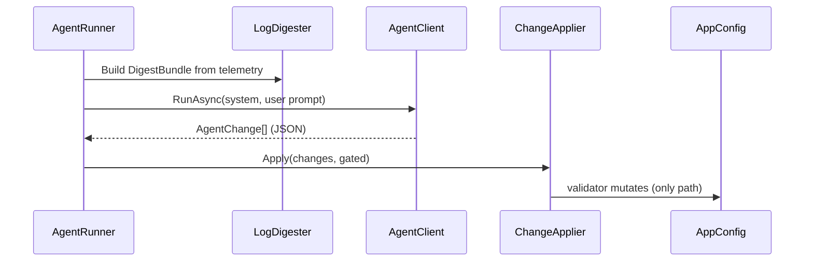

# AI Agent — LLM self-tuning loop

> **What's in this doc:** the daily LLM-driven config self-tuning loop — telemetry capture, deterministic digestion, the OpenRouter client (with retired-slug self-heal and credit-aware retry), the gated change applier, and per-category validators.
>
> **What's NOT:** the one-shot "AI Setup" rule inference from a site's SITE RULES (that's `OpenRouterClient` in [[spread#ai-assisted-rule-setup]]); the config schema the validators mutate (→ [[config]]); the racing engine the tuning targets (→ [[spread]]).

## Pipeline

`AgentRunner` (`AiAgent/AgentRunner.cs:10`) is wired in `App.xaml.cs`, runs daily at `AgentConfig.RunHourLocal` (default 04:00) plus manual `RunNowAsync` (`AiAgent/AgentRunner.cs:96`). One run: `LogDigester.Build` (`AiAgent/LogDigester.cs:8`) → deterministic `*Digester`s → compact `DigestBundle` → `AgentClient` → JSON `AgentChange` proposals → `ChangeApplier` (`AiAgent/ChangeApplier.cs:7`).

## Telemetry

`TelemetryRecorder` (`AiAgent/TelemetryRecorder.cs`) appends per-stream JSONL events to `%AppData%\GlDrive\ai-data\{stream}-{date}.jsonl` — races, nukes, announces (matched + no-match), section activity, downloads. The digesters (`RacesDigester`, `AnnouncesDigester`, `SectionFolderDigester`, etc.) roll these into a compact bundle so the model sees summaries, not raw logs.

**Section→folder learning:** `MatchedAnnounceEvent` captures release-type → IRC section on every matched announce; the enriched `RaceOutcomeEvent` records the resolved destination folder; `SectionFolderDigester` builds a co-occurrence table the agent uses to propose discriminating `SectionMapping` triggers. `SpreadJob` routes via `SectionMapper.Resolve` so learned mappings take effect (see [[spread#scoring-and-routing]]).

## AgentClient — model resilience

<!-- verified-against: read AiAgent/AgentClient.cs at git 161d19f on 2026-07-27 -->

`AgentClient` (`AiAgent/AgentClient.cs:25`) calls OpenRouter. Two failure modes were dead-lettering the whole loop for days until fixed; both carried their fix in the HTTP error body:

- **Retired slug (HTTP 404).** OpenRouter retires `:free` variants without notice; the 404 body names the successor (`use this slug instead: …`). `TryParseSuggestedModel` extracts it, retries with it, and caches it in `HealedModels` **keyed by the retired slug** so switching models in Settings isn't overridden.
- **Insufficient credit (HTTP 402).** 402 does *not* mean "broke" — OpenRouter reserves `max_tokens` up front, so a flat 32000-token request is refused while the balance covers e.g. 27229. `AttemptAsync` retries once inside the quoted budget minus 10% headroom (the quote drifts between calls); `CapTokensToBudget` returns null below `MinUsefulOutputTokens` so a pointless tiny retry is skipped. 402 never escalates to the paid fallback.

A stuck loop escalates to ERR at `PersistentFailureThreshold` = 5 consecutive failures (`AgentRunner`) instead of staying invisible at INF. Retry backoff in `ScheduleNext` (`AiAgent/AgentRunner.cs:105`) is exponential 1→64 min.

## Change gating

**Invariant: never mutate `AppConfig` outside a validator.** Every proposed mutation passes, in order:

1. Frozen-path check (`FreezeStore`).
2. Confidence threshold + per-category / total budgets.
3. A per-category validator in `AiAgent/Validators/` that **owns the actual `AppConfig` mutation**.

Validators (`AiAgent/Validators/`): `SectionMappingValidator`, `SkiplistValidator`, `BlacklistValidator`, `AffilsValidator`, `AnnounceRuleValidator`, `DownloadOnlyValidator`, `ErrorReportValidator`, `ExcludedCategoriesValidator`, `PoolSizingValidator`, `PriorityValidator`, `RequestFillerValidator`, `WishlistPruneValidator`.

`DryRunsRemaining` (default 3) gates the first live applies. `AuditTrail` records before/after + rejection reason for undo. `SectionMappingValidator` only patches **default** (`.*`/empty) triggers — user-edited triggers are preserved — and rejects appends whose `RemoteSection` isn't a known `Sections` key.

## Config & keys

Model id lives in `AgentConfig.modelId` (`appsettings.json`); the OpenRouter API key is in Windows Credential Manager (key `GlDrive:api:openrouter`), resolved via `AppConfig.ResolveOpenRouterKey()` (→ [[config]]). Written briefs land in `%AppData%\GlDrive\ai-briefs\` (pruned to newest 60).
