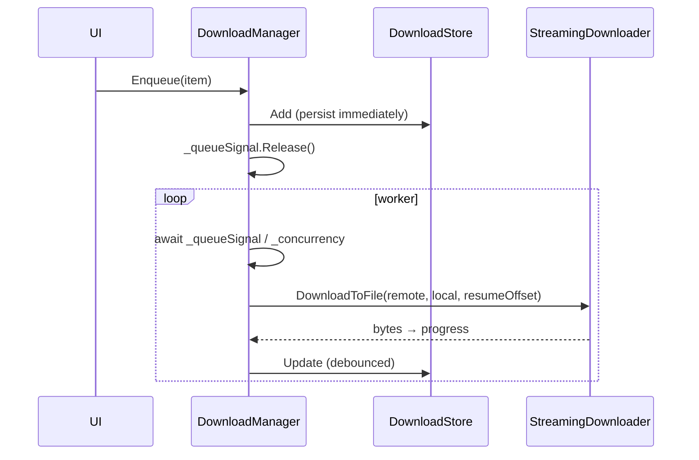

# Downloads — manager, search, wishlist, extraction

> **What's in this doc:** the per-server download manager and queue (concurrency, resume, speed limit, scheduling, disk reservation, auto-retry), SFV verification, archive extraction, cross-category FTP search, wishlist auto-download, and the metadata clients that back matching.
>
> **What's NOT:** the FTP streaming primitive downloads sit on (→ [[ftp#streaming-downloads]]); the WinFsp mount (→ [[filesystem]]); the FXP site-to-site racing engine, which is a separate path (→ [[spread]]); the extract-failure permanent/transient rules, summarized here but owned by the watch-folder extractor in [[ui]] via `ExtractFailureClassifier`.

## Ownership

Owns `src/GlDrive/Downloads/**`. One `DownloadManager` + `DownloadStore` exists per server (a download can run on a server that has no drive letter — see [[services#multi-server-orchestration]]).

## Queue and worker loop

`DownloadManager` (`src/GlDrive/Downloads/DownloadManager.cs:9`) is the queue owner. Its constructor takes the store, `FtpOperations`, a `StreamingDownloader`, config, and an optional `DiskReservation` (`src/GlDrive/Downloads/DownloadManager.cs:40`).

- **Concurrency** is a `SemaphoreSlim(config.MaxConcurrentDownloads)` (`src/GlDrive/Downloads/DownloadManager.cs:18`, `:48`). The queue itself is a plain list guarded by `_queueLock`, with a `_queueSignal` `SemaphoreSlim(0)` used as a wake-up counter (`src/GlDrive/Downloads/DownloadManager.cs:16`).
- **Enqueue** (`src/GlDrive/Downloads/DownloadManager.cs:133`) does the dedup check and the add under the **same** `_queueLock` so check-then-add is atomic (`src/GlDrive/Downloads/DownloadManager.cs:138`). It returns `false` if the item is already present — callers like the wishlist matcher rely on that.
- **Reordering / lifecycle**: `MoveUp`/`MoveDown` (`:203`/`:215`), `Cancel` (`:166`), `Retry` (`:185`), and the `RemoveCompleted`/`Failed`/`Cancelled`/`Finished` cleaners (`:198`–`:201`).
- **Shutdown**: `StopAsync` (`src/GlDrive/Downloads/DownloadManager.cs:84`) drains gracefully; `Stop` (`:120`) is the sync path.

### Scheduling window

When `ScheduleEnabled`, the worker only starts new items inside the configured hour window, computed at `src/GlDrive/Downloads/DownloadManager.cs:257` — it handles a window that wraps past midnight (`StartHour > EndHour`) by OR-ing the two half-open ranges (`:258`). Outside the window the item is re-enqueued without a retry-count penalty.

## Processing one item

`ProcessItem` (`src/GlDrive/Downloads/DownloadManager.cs:346`) runs a single download. It lists the remote path (`src/GlDrive/Downloads/DownloadManager.cs:386`) and branches:

- **Single file** — `dataFiles.Count == 0` path (`src/GlDrive/Downloads/DownloadManager.cs:390`): download the one remote file.
- **Release directory** — iterate `dataFiles` (`src/GlDrive/Downloads/DownloadManager.cs:456`), downloading each into the local release folder.

Both branches:

- **Resume** — if a partial local file exists, its length becomes the `resumeOffset` (`src/GlDrive/Downloads/DownloadManager.cs:395`, `:474`) passed to `StreamingDownloader.DownloadToFile` (`:410`, `:501`); the item emits a `"resumed"` outcome (`:401`, `:489`). `DownloadedBytes` is deliberately **not** reset on retry so resume works across restarts (`:191`).
- **Disk reservation** — before a multi-file download, `DiskReservation.TryReserve` (`src/GlDrive/Downloads/DiskReservation.cs:48`) claims the remaining bytes against the target drive so concurrent downloads don't each "see enough room" and collectively overrun the disk (`src/GlDrive/Downloads/DownloadManager.cs:439`). The reservation is released exactly once when the item finishes. `DiskReservation` keeps per-root reserved totals in a `ConcurrentDictionary` with a 64 MiB headroom default (`src/GlDrive/Downloads/DiskReservation.cs:19`, `:22`).

### Speed limiting

The throttle lives in `StreamingDownloader`, not the manager: `speedLimitKbps` becomes `_speedLimitBytesPerSecond` (`src/GlDrive/Ftp/StreamingDownloader.cs:21`), and the read loop sleeps to hold the average rate by comparing elapsed time to `bytesRead / limit` (`src/GlDrive/Ftp/StreamingDownloader.cs:150`).

### Auto-retry

On failure, if `RetryCount < MaxRetries` (`src/GlDrive/Downloads/DownloadManager.cs:588`) the item is re-scheduled via `ScheduleRetry` (`:307`) with a linear backoff of `RetryDelaySeconds * RetryCount` (`:591`). `RetryCount` is post-incremented, so the logged number means "scheduling attempt N" (`:598`).

## Post-download: SFV + extraction

After bytes land, if `VerifySfv` is set (`src/GlDrive/Downloads/DownloadManager.cs:511`), `SfvVerifier.VerifyAsync` (`src/GlDrive/Downloads/SfvVerifier.cs:9`) reads every `*.sfv` in the release dir and CRC-32-checks each listed file (`src/GlDrive/Downloads/SfvVerifier.cs:12`, `:43`), returning the list of mismatches.

Then, if `AutoExtract` is set (`src/GlDrive/Downloads/DownloadManager.cs:537`), the item flips to `DownloadStatus.Extracting` (`:541`) and `ArchiveExtractor.ExtractIfNeeded` (`src/GlDrive/Downloads/ArchiveExtractor.cs:21`) runs. On success, the archive set is deleted when `DeleteArchivesAfterExtract` is set (`src/GlDrive/Downloads/DownloadManager.cs:548`).

`ArchiveExtractor` (`src/GlDrive/Downloads/ArchiveExtractor.cs:11`) uses SharpCompress for RAR, detecting multi-part sets by the `.partNN.rar` naming (`src/GlDrive/Downloads/ArchiveExtractor.cs:18`). `DeleteArchiveSet` (`:115`) removes a whole volume set from its first volume. Extraction writes through `ArchiveFileOperations.CopyToFileAtomically` (`src/GlDrive/Downloads/ArchiveFileOperations.cs:11`) so a crash mid-extract can't leave a half-written output in place of the real file.

Extract-failure classification — permanent vs transient (`ExtractFailureKind`, `src/GlDrive/Downloads/ExtractFailureClassifier.cs:6`) via `Classify` (`src/GlDrive/Downloads/ExtractFailureClassifier.cs:77`) — treats incomplete volume sets, truncated payloads, and UnRAR CRC/password exits as permanent (exit 6 open-error stays transient). It lives in this namespace but its consumer is the standalone watch-folder extractor UI, not this inline auto-extract path — see [[ui]].

## Persistence

`DownloadStore` (`src/GlDrive/Downloads/DownloadStore.cs:9`) persists to `%AppData%\GlDrive\downloads-{serverId}.json` (`src/GlDrive/Downloads/DownloadStore.cs:28`). Writes are debounced (`ScheduleSave`, `:60`) **except** for events that must survive an immediate crash: `Add` (`:91`) and `Remove` (`:111`) save synchronously, and `Update` saves immediately when the new status is terminal (`:108`). `Items` returns a locked snapshot copy (`:24`).

`DownloadItem` (`src/GlDrive/Downloads/Models.cs:28`) carries `RemotePath`, `LocalPath`, byte counters, `Status` (`DownloadStatus` enum — Queued/Downloading/Extracting/Completed/Failed/Cancelled, `src/GlDrive/Downloads/Models.cs:6`), timestamps, `RetryCount`, `ErrorMessage`, and an optional `WishlistItemId` back-reference (`:41`).

## Search

`FtpSearchService` (`src/GlDrive/Downloads/FtpSearchService.cs:9`) provides cross-category search. `Search` (`src/GlDrive/Downloads/FtpSearchService.cs:45`) returns `List<SearchResult>` for a keyword; `RefreshIndex` (`:275`) builds the category index (with `StopIndexerAsync` for teardown, `:353`); `GetReleaseFiles` (`:513`) lists the files under a chosen result for enqueue.

## Wishlist

`WishlistStore` (`src/GlDrive/Downloads/WishlistStore.cs:9`) holds the global `wishlist.json` (`src/GlDrive/Downloads/WishlistStore.cs:12`) of `WishlistItem`s (`src/GlDrive/Downloads/Models.cs`, `WishlistStatus` Watching/Completed/Paused).

`WishlistMatcher` (`src/GlDrive/Downloads/WishlistMatcher.cs:9`) subscribes to new-release events via `OnNewRelease(category, releaseName, remotePath)` (`src/GlDrive/Downloads/WishlistMatcher.cs:33`). For each watching item it:

1. Skips releases already in `GrabbedReleases` (`src/GlDrive/Downloads/WishlistMatcher.cs:47`).
2. Matches by media type through `SceneNameParser` — `MatchesMovie` / `MatchesTvEpisode` (`src/GlDrive/Downloads/WishlistMatcher.cs:52`–`:53`), which check season/episode → title → year → quality in that order (`:119`). Quality is only enforced when both sides declare a non-`Any` profile (`:122`).
3. On a match, `Enqueue`s the download (`src/GlDrive/Downloads/WishlistMatcher.cs:96`), records the release in `GrabbedReleases` (`:102`), and raises `MatchFound` (`:104`) for the UI/notification layer.

New-release events themselves come from `NewReleaseMonitor` (→ [[services]]); the same stream also feeds auto-races (→ [[spread#auto-race-triggers]]).

## Metadata & notifications

Supporting clients (all `IDisposable` HTTP wrappers), used by the wishlist/search UI for enrichment and matching:

- `SceneNameParser` (`src/GlDrive/Downloads/SceneNameParser.cs:5`) — parses scene release names into title/year/season/episode/quality; the core of wishlist matching.
- `TmdbClient` (`src/GlDrive/Downloads/TmdbClient.cs:8`), `TvMazeClient` (`src/GlDrive/Downloads/TvMazeClient.cs:8`), `OmdbClient` (`src/GlDrive/Downloads/OmdbClient.cs:11`) — movie/TV metadata lookups.
- `PreDbClient` (`src/GlDrive/Downloads/PreDbClient.cs:8`) — scene pre database queries.
- `NotificationStore` (`src/GlDrive/Downloads/NotificationStore.cs`) — persists `NotificationItem`s (server/category/release/path/timestamp) surfaced in the dashboard.

## Gotchas

- `DownloadManager.Enqueue` returning `false` is a **dedup signal, not an error** — the wishlist matcher only records a grab when it wins the enqueue race.
- Never add a separate eager download pool: it starves the FXP racing engine at the shared login cap (see [[ftp#login-gate]], [[spread#login-budget]]).
- FluentFTP v53's `OpenRead` resume parameter is **positional** — see [[ftp#streaming-downloads]].
