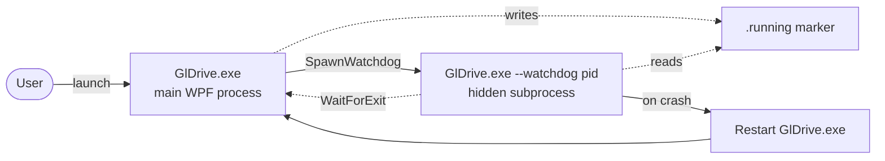
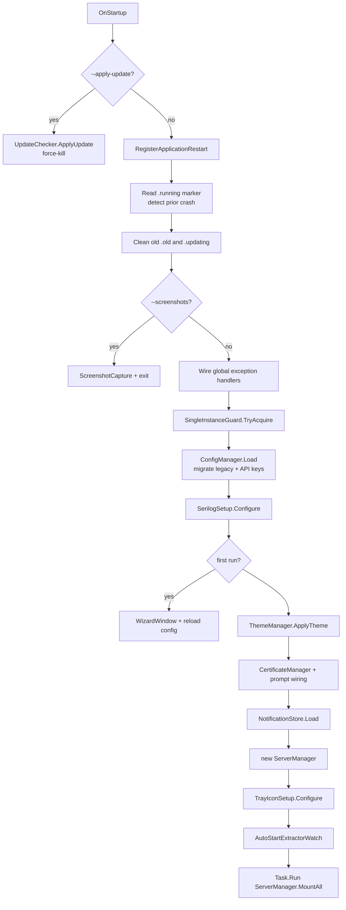
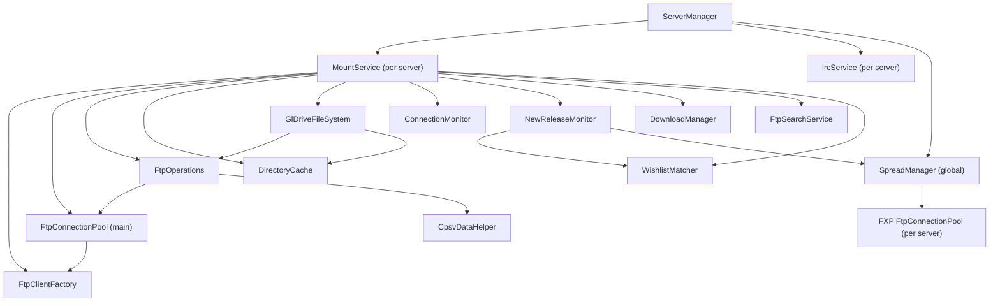
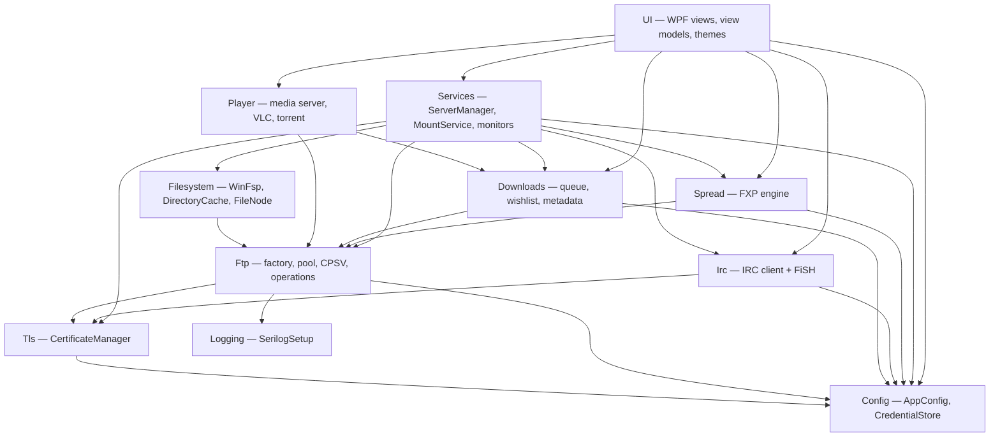
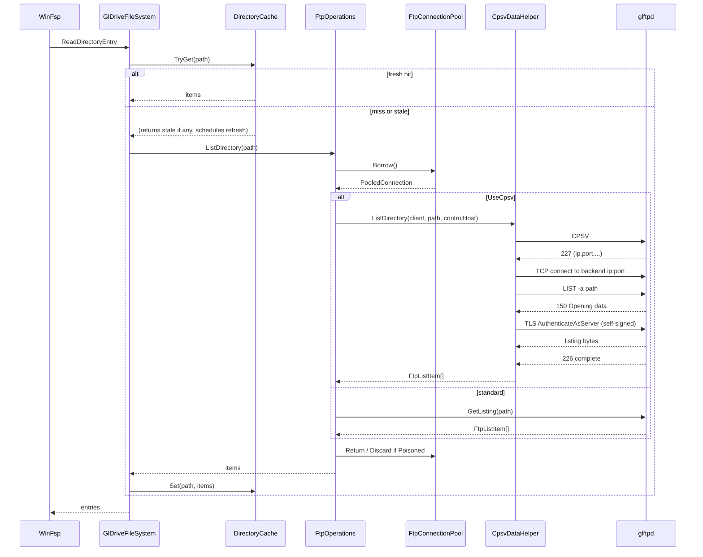
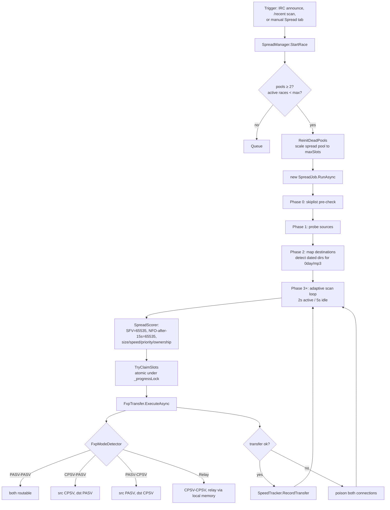
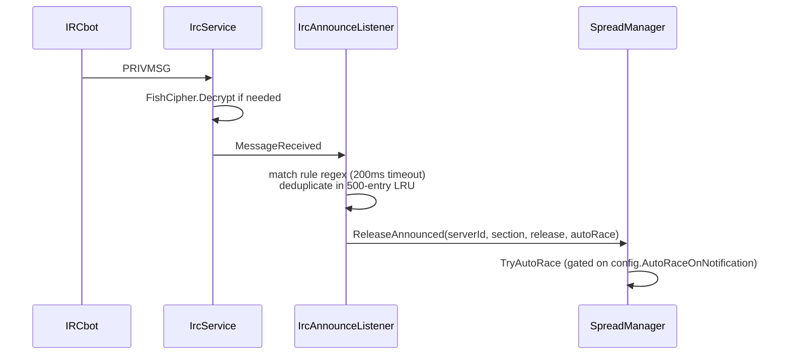
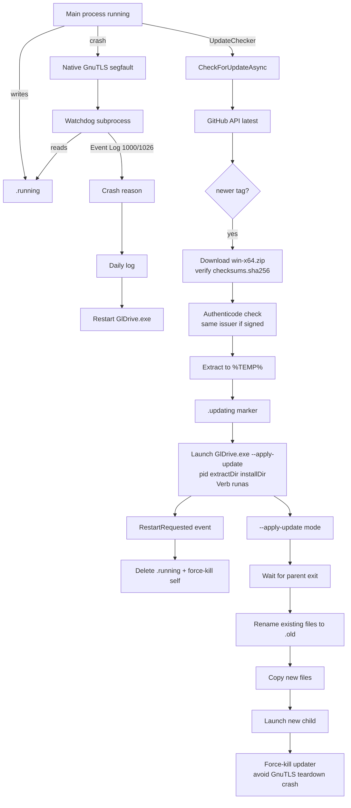

# System Architecture

This document maps the runtime structure of GlDrive — how processes start, how servers mount, how FTP data flows, and how the FXP/IRC subsystems hang off the side of the main pipeline.

## Contents
- [Process model](#process-model)
- [Startup sequence](#startup-sequence)
- [Multi-server composition](#multi-server-composition)
- [Subsystem dependency graph](#subsystem-dependency-graph)
- [FTP request flow](#ftp-request-flow)
- [CPSV data connections](#cpsv-data-connections)
- [Spread / FXP engine](#spread--fxp-engine)
- [IRC service](#irc-service)
- [Update + crash recovery](#update--crash-recovery)

---

## Process model

GlDrive runs as two cooperating processes in normal operation:

If the main process exits with `.running` still on disk, the watchdog treats it as a crash, pulls the reason from the Windows Application Event Log (EventID 1000 / 1026), writes it to today's log, and relaunches. This is the fallback for native GnuTLS crashes that escape managed exception handlers.

A third, short-lived process mode — `--apply-update` — runs elevated during in-app updates and exits as soon as the new child has been spawned.

See [codebase-summary.md#entry-points--modes](codebase-summary.md#entry-points--modes) for the argv dispatch table.

---

## Startup sequence

`App.xaml.cs:OnStartup` runs a single, ordered chain. Each step assumes the previous one succeeded.

Key invariants:
- Config is loaded **before** Serilog, because `SerilogSetup.Configure(LoggingConfig)` needs `LoggingConfig.Level`.
- `SingleInstanceGuard` uses a `Global\GlDriveInstance` mutex and retries 3× with 2-second delays so crash-restart scenarios don't trip on a mutex the dying process hasn't released yet.
- `MountAll` runs on a background `Task.Run` — the UI must never block waiting for FTP.
- On `OnExit`, the chain reverses: `ServerManager.Dispose()` → tray icon dispose → mutex release → delete `.running`.

---

## Multi-server composition

`ServerManager` is the top-level orchestrator. Each configured server gets its own composition chain:

Each `MountService` owns an **independent** FTP pool, operations router, filesystem instance, and downloads manager. Servers are completely decoupled at runtime.

`SpreadManager` maintains a **separate** FTP pool per server, sized to `max(config.Spread.SpreadPoolSize, maxSlots)`. This is deliberate: the spread pool must not starve the main pool when a race is running.

When spread is active on a server, the main pool is capped at 2 connections (down from the usual 3) to leave BNC session headroom.

---

## Subsystem dependency graph

Layering of the codebase. An arrow means "top-level depends on bottom-level."

`Config` and `Logging` are the lowest-level leaves; `UI` is the only subsystem nothing else depends on.

---

## FTP request flow

A single Explorer request — for example, listing `G:\TV\Some.Show.S01E01-GROUP\` — flows through this path:

The FTP gate inside `GlDriveFileSystem` is a semaphore sized to `Environment.ProcessorCount` so Explorer / cmd.exe traffic bursts don't starve the thread pool.

Writes go through `FileNode.GetOrCreateWriteStream()` which returns a `MemoryStream` until it hits `SpillThresholdBytes` (50 MB), at which point writes migrate to a `DeleteOnClose` temp file. On `Cleanup` with `IsDirty = true`, the active stream is uploaded.

---

## CPSV data connections

This is the most delicate part of the FTP stack. glftpd behind a BNC answers `PASV` with backend addresses the client can't route to, so the client must use **CPSV** (Clear Passive) and *be* the TLS server on the data channel. FluentFTP doesn't know how to do this, so `CpsvDataHelper` implements it by hand.

Steps in `CpsvDataHelper`:

1. **`CPSV` on the control channel** → server replies with `(a,b,c,d,p1,p2)` in PASV format. Parse it; that's the backend data address.
2. **Raw TCP connect** to `a.b.c.d:(p1*256+p2)` with a 10-second timeout. No TLS yet.
3. **Send the data command** (`LIST -a <path>`, `RETR <path>`, `STOR <path>`, …) on the **control** channel. Expect `150` or `125`. Do **not** wait for `226` here.
4. **TLS `AuthenticateAsServerAsync`** on the raw TCP socket. This is the inverted role: we present a certificate, glftpd acts as TLS client. The cert is a cached lazy self-signed RSA-2048 / SHA-256 / 10-year certificate with CN=`GlDrive`.
5. **Stream the data.** LIST → parse Unix `ls -l` output. RETR → binary file bytes. STOR → binary file bytes.
6. **Close the data socket**, then read `226` on the control channel.

For `RETR` with resume:
- Send `REST <offset>` on the control channel *before* the retry loop
- If REST succeeds, open the local file with `FileMode.Append`
- If REST fails, fall back to `FileMode.Create` and restart from 0

`CpsvDataHelper.SanitizeFtpPath()` strips CR, LF, and NUL bytes from every path before it goes on the wire — FTP commands are newline-terminated, so any injected `\r\n` would be interpreted as new commands. This is the fix for the `v1.44.55` "media server FTP injection" vulnerability.

The `TYPE I` → (optional `REST`) → `CPSV`/`PASV` → data command order matters. `FxpTransfer.SendTypeI()` logs an explicit warning if the TYPE reply doesn't look like an FTP completion, because BNCs sometimes queue responses and desynchronize the FluentFTP response parser.

---

## Spread / FXP engine

Site-to-site racing is orchestrated by `SpreadManager` and executed by `SpreadJob` + `FxpTransfer`.

Chain mode (default since v1.44.35): a job holds a single route until all in-flight transfers drain, *then* picks the next hop. This prevents thrashing when a destination is slower than the source.

Four FXP modes, picked by `FxpModeDetector` from the pair's CPSV capability:

| Source CPSV | Dest CPSV | Mode | Notes |
|---|---|---|---|
| no | no | **PASV-PASV** | Plain FXP, both routable |
| yes | no | **CPSV-PASV** | Source behind BNC — source does `SSCN ON` + `CPSV`, dest does `PORT` |
| no | yes | **PASV-CPSV** | Dest behind BNC — dest does `SSCN ON` + `CPSV`, source does `PORT` |
| yes | yes | **Relay** | Both behind BNC — `CpsvDataHelper` opens both data channels locally, double-buffered memory copy (256 KB buffers) pipes bytes between them |

`FxpTransfer.SendTypeI()` is called before every transfer as a BNC-queue-desync canary; `EnableSscn()` sends `SSCN ON` to negotiate encrypted FXP control data.

Scoring (0 → 65535) happens in `SpreadScorer.Score`:

- SFV file → **65535** (absolute priority)
- NFO file, elapsed ≥ 15 s → **65535**
- Otherwise: `(size/max) × 2000` + `(route_speed/max_speed) × 3000` + `sitePriority (0-2500)` + ownership term (`(1 - owned%) × 2000` in Race mode, `owned% × 2000` in Distribute mode)

Skiplist evaluation (`SkiplistEvaluator`) is cascading: per-site rules first, then global, first match wins, glob OR non-backtracking 100 ms regex. Phase 0 evaluates the release *directory name* before any file scanning — if it's denied, the race aborts immediately.

Race history (max 500 entries) persists to `race-history.json` for the Dashboard "Race History" tab.

---

## IRC service

Each server with IRC configured gets its own `IrcService`, wired into `ServerManager` via `_ircServices`.

Key properties:
- TLS via `CertificateManager` (same TOFU store as FTP)
- TCP keepalive: 60 s first probe, 15 s interval, 3 retries
- Liveness: periodic PING every 90 s; 180 s silence → dead → reconnect
- Auto-reconnect with exponential backoff, reset after 60 s of stability
- `SiteInviteFunc` delegate — set by `ServerManager` to a closure that borrows a connection from the **FTP** pool and runs `SITE INVITE <nick>` before auto-joining channels (handles invite-only channels)
- FiSH encryption: detects `+OK ` (ECB) / `+OK *` (CBC), decrypts/encrypts per-target. Keys live in `fish-keys-{serverId}.json`, DPAPI-encrypted.
- DH1080 key exchange: fixed 1080-bit prime, SHA-256 of the shared secret as the Blowfish key. `Dh1080.TryParseInit` / `TryParseFinish` tolerate the trailing ` CBC` suffix some clients send.

IRC-driven release detection flows:

`IrcPatternDetector` buffers 100 messages per nick per channel, identifies likely bots (≥ 30 % of messages contain scene releases), extracts fixed/variable sections, and proposes a regex. The Dashboard "IRC" tab surfaces detected patterns as clickable suggestions for `IrcAnnounceRule`.

---

## Update + crash recovery

Updates and crashes share infrastructure: `.running` / `.updating` marker files, the hidden watchdog subprocess, and Windows Restart Manager.

Important constraints:

- **`--apply-update` is called *before* WPF boots** in `App.OnStartup`. The updater path must not touch `ConfigManager.Load` — that would require JSON deserialization, which is why the watchdog path is also kept minimal.
- The updater **force-kills itself** after spawning the child. Graceful exit goes through GnuTLS native disposal, which can segfault on a dying process with open TLS connections to nobody.
- SHA-256 verification against `checksums.sha256` is **mandatory**. If the checksums asset is missing or the hash doesn't match, the update aborts and the zip is deleted.
- Authenticode verification is conditional: if the *current* binary is unsigned (dev builds), it's skipped. If signed, the update must be signed by the same issuer to prevent cross-signed downgrade attacks.

See [deployment-guide.md](deployment-guide.md) for how the release pipeline produces the assets the updater consumes.

---

## See also

- [project-overview-pdr.md](project-overview-pdr.md) — why each of these decisions exists
- [codebase-summary.md](codebase-summary.md) — where each type in the diagrams lives
- [configuration-guide.md](configuration-guide.md) — every knob the runtime reads
- [code-standards.md](code-standards.md) — patterns that keep the chains above tractable
